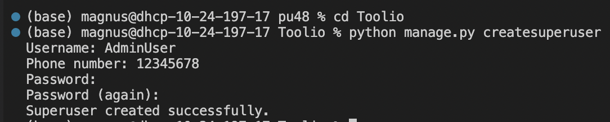
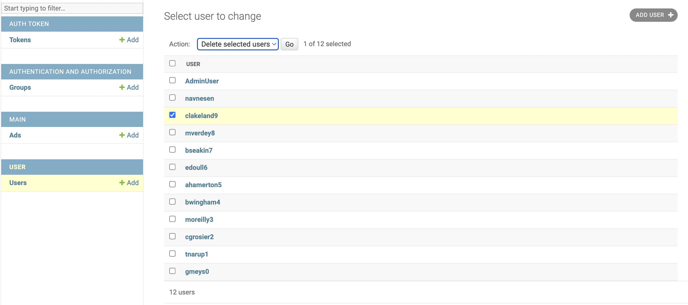
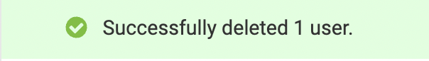
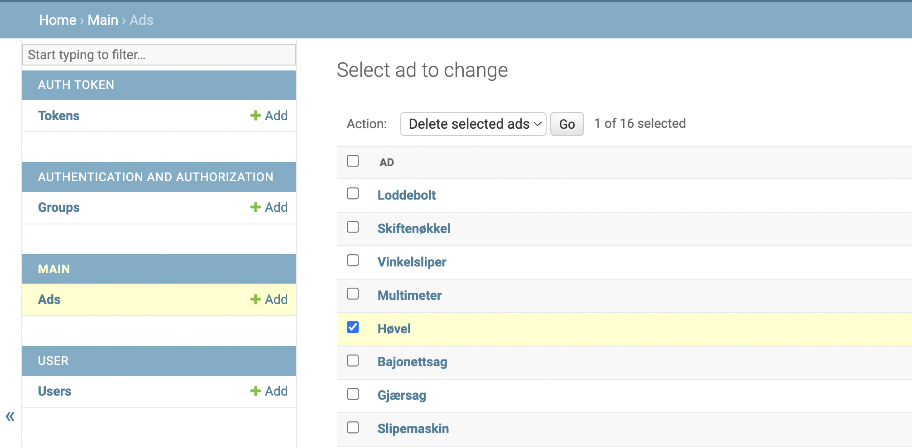
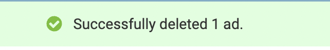

<p align="center">
  <a href="" rel="noopener">
  </a>
</p>

<h3 align="center">Toolio</h3>

---

This is the code repo for group 48 in the subject [TDT4140 Software Engineering](https://www.ntnu.edu/studies/courses/TDT4140#tab=omEmnet).

## Table of Contents

- [About](#about)
- [Getting Started](#getting_started)
- [Deployment](#deployment)
- [Usage](#usage)
- [Built Using](#built_using)
- [Dependencies](#dependencies)
- [TODO](docs/TODO.md)
- [Contributing](docs/CONTRIBUTING.md)
- [Roadmap](#roadmap)
- [Authors](#authors)
- [Acknowledgments](#acknowledgement)

## 🧐 About <a name = "about"></a>

Toolio is a platform where users can lend out their tools and equipment to each other by publishing advertisements. Through constant dialogue with our Student Assistant, who has simulated the role of Product Owner throughout this project, we have developed a product fulfilling his wishes and requirements.

To illustrate the product's functionality goals of Sprint 1, a Figma [model](https://www.figma.com/file/7mZ3F55lnI0v0tEG3I7XU6/TOOLIO-SPRINT-1?node-id=25%3A227&t=KHcrblGRzwLO8f9o-1) was created.

## 🏁 Getting Started <a name = "getting_started"></a>

These instructions will get you a copy of the project up and running on your local machine for development and testing purposes. See [deployment](#deployment) for notes on how to deploy the project on a live system.

### Prerequisites

What you need to install the software, as well as how to install them.

```
Give examples
```

1. Download [git](https://git-scm.com/downloads) if not already installed.
2. Python download

### Installation

A step by step series of examples that tell you how to get a development environment running.

Before installing the project make sure you have installed all the [required](#prerequisites) technologies for this project. Navigate to the folder where you want to have the project, and clone the project here.

```
git clone https://gitlab.stud.idi.ntnu.no/tdt4140-2023/landsby-3/gruppe-48/pu48.git
```

In the folder `pu48/Toolio/` install all dependecies.

```
pip install -r requirements.txt
```

To create and apply the database schema run the following commands.

```
python manage.py makemigrations
python manage.py migrate
```

Then you can start the server.

```
python manage.py runserver
```

In the terminal a url will be displayed for where you can view the website. The default is [http://localhost:8000/](http://localhost:8000/). To view the website simply go to this url.

To populate the website with objects and users, navigate to Usage see the instructions about resetting the database and loading data from
google spreadsheets.

## 🔧 Running the tests <a name = "tests"></a>

This project has only used unit-testing. To run all the test type the following command:
`python manage.py test ?Toolio?`

### Test-coverage

To display the test coverage the python library coverage must first be installed.

```
pip install coverage
```

To get a coverage report in the terminal run the following command, but replace the '#' with one of the following: main, Toolio, user.

```
coverage run --source='#' manage.py test && coverage report
```

To also get a html coverage report run the following command.

```
coverage run --source='#' manage.py test && coverage report && coverage html
```

To open the html report [live server](https://github.com/tapio/live-server) can be used, if not already installed run:

```
npm i -g live-server
```

and then to open the report run:

```
cd htmlcov/ && live-server
```

## 🎈 Usage <a name="usage"></a>

### Reset the Database

Navigate to the right folder.

```
cd ./pu48/Toolio
```

Answer 'yes' if asked whether you're sure about resetting.

```
python manage.py flush
```

### Load data from Google Spreadsheets

We have made a script that loads data from a Google Spreadsheet and dumps it into a json file, this file can be used to load data into the database.

#### Google Sheet API

Store the API key in `keys.json` inside the `Toolio` folder. Make sure this file is listed in the `.gitignore` file to avoid it being exposed through a public repository.

#### Run script and load data

1. Run the `read_users.py` file to generate the `users.json` file

```
python read_users.py
```

2. Load the file into the database

```
python manage.py loaddata users.json
```

Repeat the steps for `read_ads.py` and `ads.json`.

### Make a New Super User

Navigate to the right folder.

```
cd ./pu48/Toolio
```

Create a new super user by running the following command:

```
python manage.py createsuperuser
```

<p align="left">
  <a href="" rel="noopener">
  </a>
</p>

1. Insert a username for your Admin user
2. Insert your Phone Number
3. Choose a safe password
4. Repeat your password

A superuser has the ability to edit and delete a user or ad via the Django Administration site.
To open the Django Administration site, visit the [http://localhost:8000/admin/](http://localhost:8000/admin/) URL while running the server. Here you can login with your superuser credentials.

## Delete a User from the Django Administration page:

<p align="left">
  <a href="" rel="noopener">
  </a>
</p>

1. Select "Users". Here you have an overview over all existing users in the database.
2. Check the box next to a user
3. Choose "Delete selected users" from the pull-down menu
4. Click "Go". The selected user(s) and their respective ads will then be deleted from the database.

<p align="left">
  <a href="" rel="noopener">
  </a>
</p>

## Delete an Ad from the Django Administration page:

<p align="left">
  <a href="" rel="noopener">
  </a>
</p>

1. Navigate to the Django Administration homepage, and select "Ads". Here you have an overview over all existing ads in the database.
2. Check the box next to an ad
3. Choose "delete selected ads" from the pull-down menu
4. Click "Go". The selected ad(s) will then be deleted from the database.
<p align="left">
  <a href="" rel="noopener">
  </a>
</p>

## ⛏️ Built Using <a name = "built_using"></a>

- [Python 3.9.6](https://www.python.org/downloads/) - General-purpose programming language
- [Django 3.2.8](https://www.djangoproject.com) - Web Framework
- [Bootstrap4](https://getbootstrap.com/docs/4.1/getting-started/introduction/) - Frontend

## ⛏️ Dependencies <a name = "dependencies"></a>

- [Crispy-forms#](https://github.com/django-crispy-forms/django-crispy-forms) - A Django package for building and customizing forms.
- [Pillow#](https://python-pillow.org) - A Python imaging library

## ✍️ Authors <a name = "authors"></a>

- Magnus Stavland Jakobsen, magnsjak@stud.ntnu.no
- Andreas Granhøy-Lieng, andrgran@stud.ntnu.no
- Iver Ringheim, iverri@stud.ntnu.no
- Mats Kjær, mbkjaer@stud.ntnu.no
- Aksel Henrik Lessum, akselhl@stud.ntnu.no
- Ksenia Mordovets, kseniam@stud.ntnu.no

## 🎉 Acknowledgements <a name = "acknowledgement"></a>

- Hat tip to anyone whose code was used
- Inspiration
- References
- [The Documentation Compendium](https://github.com/kylelobo/The-Documentation-Compendium) - kylelobo

## ✒️ License

[Apache 2.0](LICENSE.txt)
